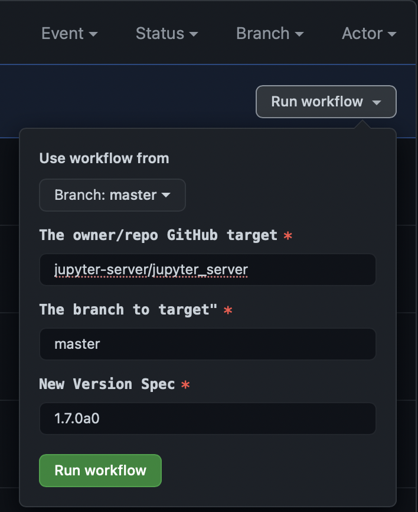
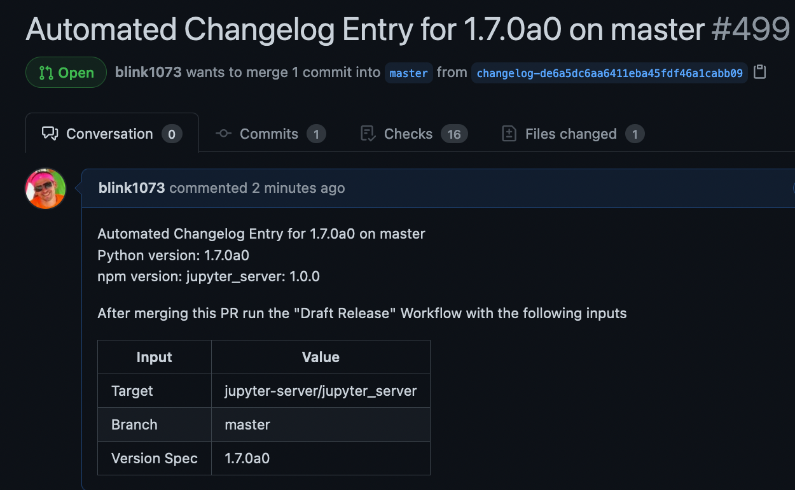
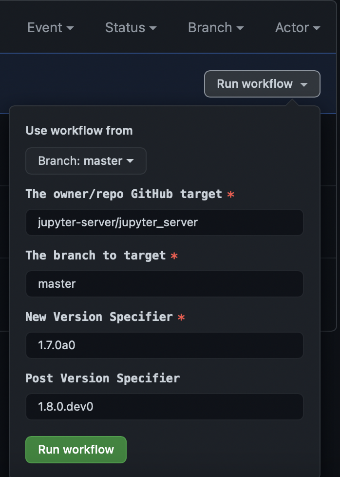
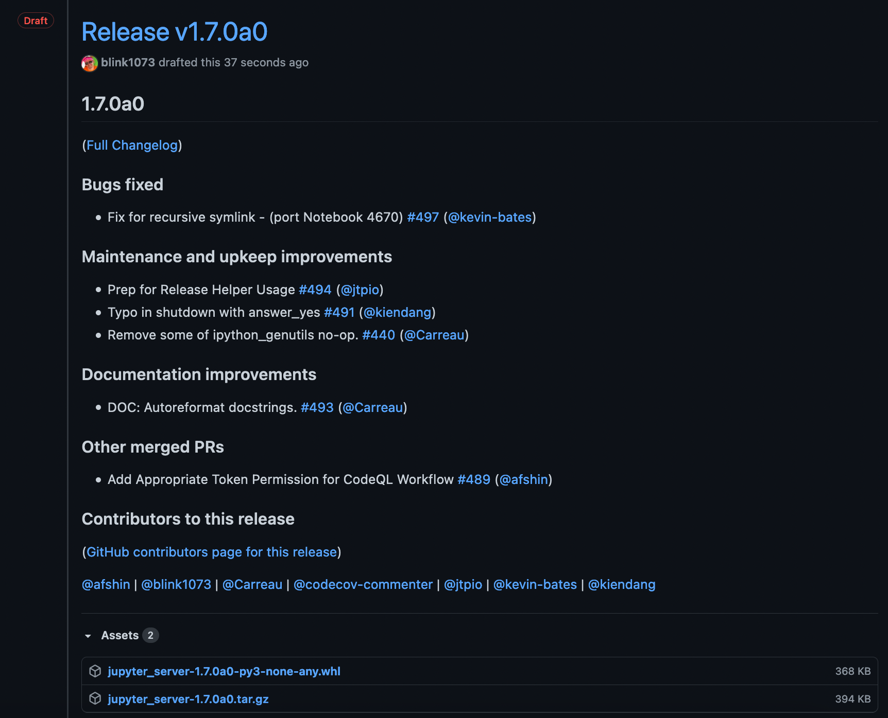
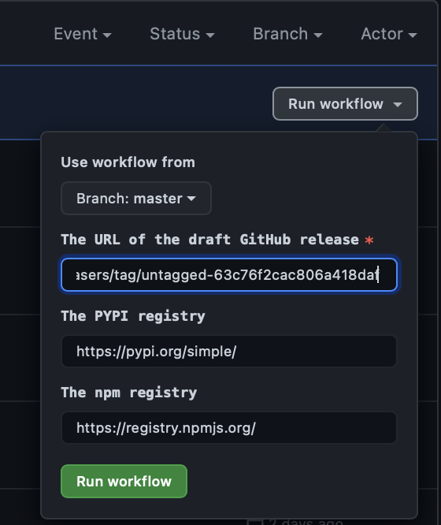
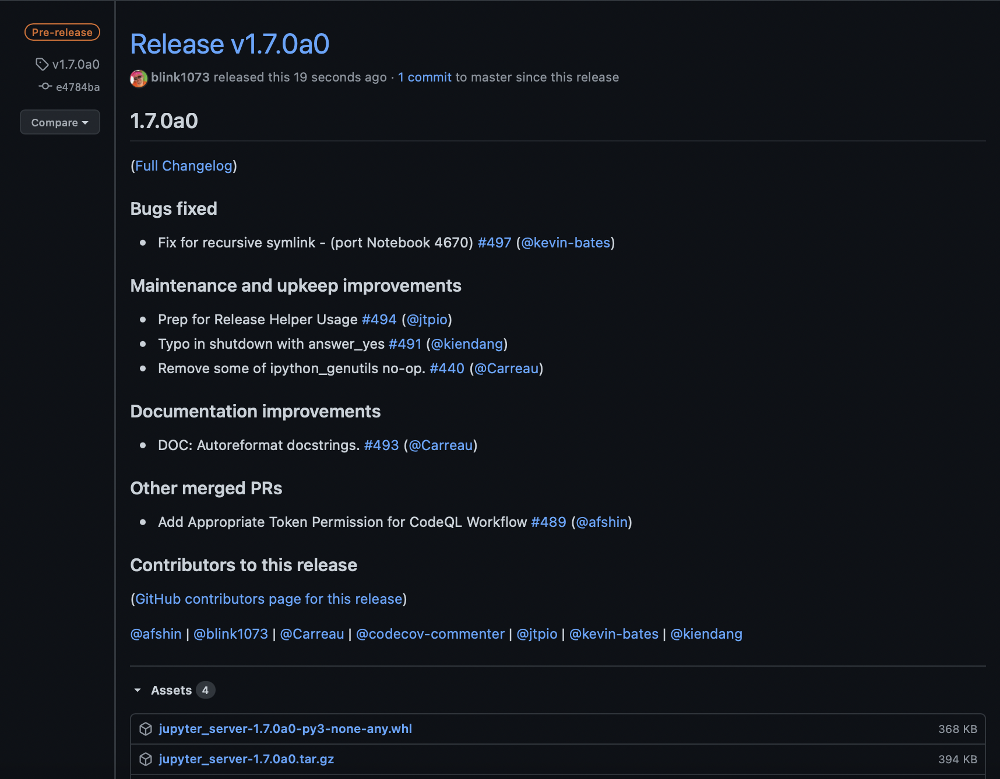

# Jupyter Releaser

** Experimental! **

**Jupyter Releaser** contains a set of helper scripts and GitHub Actions to aid in automated releases of Python and npm packages.

## Motivation

This project should help maintainers reduce toil and save time in the release process by enforcing best practices to:

- Automate a changelog for every release
- Pre-publish to test server and verify the install and import of dist asset(s)
- Commit a message with hashes of dist file(s)
- Annotate the git tag in standard format
- Create a GitHub release with changelog entry
- Verify url links in markdown and reStructuredText files
- Verify integrity of Python manifest
- Forward port changelog entries into default branch
- Dry run publish on CI
- Revert to Dev version after release (optional)

## Prerequisites

See [checklist](#Checklist-for-Adoption) below for details:

- Markdown changelog
- Bump version configuration (if using Python), for example [tbump](https://github.com/dmerejkowsky/tbump)
- [Access token](https://docs.github.com/en/github/authenticating-to-github/creating-a-personal-access-token) with access to target GitHub repo to run GitHub Actions.
- Access token for the [PyPI registry](https://packaging.python.org/guides/publishing-package-distribution-releases-using-github-actions-ci-cd-workflows/#saving-credentials-on-github)
- If needed, access token for [npm](https://docs.npmjs.com/creating-and-viewing-access-tokens).

## Typical Workflow

When ready to make a release:

1. Fork the `jupyter-releaser` repo and go to the Actions panel
2. Select the `Draft Changelog` workflow
3. Run the workflow with the version spec (usually the new version number). If making a final release after
   a prerelease series, you may wish to use the "until" parameter to include all the PRs since the last final release.

<p align="center">

</p>

4. When the run completes, review the changelog PR that was opened and make any desired edits.

<p align="center">

</p>

<p align="center">

</p>

5. Merge the PR
6. Return to the Actions panel in the `jupyter-releaser` fork
7. Select the `Draft Release` workflow

<p align="center">

</p>

8. Run the workflow with the same version spec as before, and optionally, a post version spec if you want to go back to a dev version in the target branch. Make sure to use the same "until" parameter used in "Draft Changelog", if applicable.
9. When the workflow completes, go to the releases page in the target repository and verify that the new draft release is there with the correct changelog and dist files.

<p align="center">

</p>

<p align="center">

</p>

10. Copy the url of the draft release.
11. Run the `Publish Release` workflow from the `jupyter-releaser` fork.

<p align="center">

</p>

<p align="center">

</p>

<p align="center">

</p>

12. If the release was on a backport branch, a forward port PR will have been opened against
    the default branch with the new changelog entry. Review and merge this PR.

<!-- TODO: Add forward port PR image here -->

## Installation

To install the latest release locally, make sure you have
[pip installed](https://pip.readthedocs.io/en/stable/installing/) and run:

```bash
    pip install git+https://github.com/jupyter-server/jupyter-releaser
```

## Library Usage

```bash
    jupyter-releaser --help
    jupyter-releaser build-python --help
    jupyter-releaser check-links --help
```

## Configuration

### Command Options and Environment Variables

All of the commands support CLI and Environment Variable Overrides.
The environment variables are defined by the `envvar` parameters in the
command options in `cli.py`. The environment variables unique to
`jupyter-releaser` are prefixed with `RH_`. A list of all env variables can be seen
by running `jupyter-releaser list-envvars`.

### Default Values, Options, Skip, and Hooks

The default values can also be overriden using a config file.

Options can be overridden using the `options` section.

You can skip one or more commands using a `skip` section, which is a list of
commands to skip.

You can also define hooks to run before and after
commands in a `hooks` section. Hooks can be a shell command to run or
a list of shell commands, and are specified to run `before-` or `after-`
a command.
Note: the only invalid hook name is `before-prep-git`, since a checkout of the target repository is not yet available at that point.

### Configuration File Priority

This is where `jupyter-releaser` looks for configuration (first one found is used):

```code
    .jupyter-releaser.toml
    pyproject.toml (in the tools.jupyter-releaser section )
    package.json (in the jupyter-releaser property)
```

Example `.jupyter-releaser.toml`:

```toml
[options]
dist_dir = "mydist"

skip = ["check-links"]

[hooks]
before-tag-version = "npm run pre:tag:script"
```

Example `pyproject.toml` section:

```toml
[tools.jupyter-releaser.options]
dist_dir = "mydist"

[tools.jupyter-releaser]
skip = ["check-links"]

[tools.jupyter-releaser.hooks]
after-build-python = ["python scripts/cleanup.py", "python scripts/send_email.py"]
```

Example `package.json`:

```json
{
  "name": "my-package",
  "jupyter-releaser": {
    "options": {
      "dist_dir": "mydist"
    },
    "skip": ["check-manifest"],
    "hooks": {
      "before-publish-dist": "npm run pre:publish:dist"
    }
  }
}
```

## Checklist for Adoption

A. Prep the `jupyter_releaser` fork:

- [ ] Clone this repository onto your GitHub user account.
- [ ] Add a [GitHub Access token](https://docs.github.com/en/github/authenticating-to-github/creating-a-personal-access-token) with access to target GitHub repo to run GitHub Actions, saved as
      `ADMIN_GITHUB_TOKEN` in the [repository secrets](https://docs.github.com/en/actions/reference/encrypted-secrets#creating-encrypted-secrets-for-a-repository).
- [ ] Add access token for the [PyPI registry](https://packaging.python.org/guides/publishing-package-distribution-releases-using-github-actions-ci-cd-workflows/#saving-credentials-on-github) stored as `PYPI_TOKEN`.
      _Note_ For security reasons, it is recommended that you scope the access
      to a single repository, and update the value of `PYPI_TOKEN` for each repository that you are releasing.
- [ ] If needed, add access token for [npm](https://docs.npmjs.com/creating-and-viewing-access-tokens), saved as `NPM_TOKEN`.

B. Prep target repository:

- [ ] Switch to Markdown Changelog
  - We recommend [MyST](https://myst-parser.readthedocs.io/en/latest/?badge=latest), especially if some of your docs are in reStructuredText.
  - Can use `pandoc -s changelog.rst -o changelog.md` and some hand edits as needed.
  - Note that [directives](https://myst-parser.readthedocs.io/en/latest/using/syntax.html#syntax-directives) can still be used
- [ ] Add HTML start and end comment markers to Changelog file - see example in [CHANGELOG.md](./CHANGELOG.md) (view in raw mode)
- [ ] Add [tbump](https://github.com/tankerhq/tbump) support if using Python - see example metadata in [pyproject.toml](./pyproject.toml)
  - We recommend putting `setuptools` metadata in `setup.cfg` and using `version attr: <package_name>.__version__`, see example [`setup.cfg`](./setup.cfg)
  - See documentation on `setup.cfg` [metadata](https://setuptools.readthedocs.io/en/latest/userguide/declarative_config.html)
  - If previously providing `version_info`, use a snippet like the one below, since `tbump` requires the intact version string, e.g.

```python
import re

# Version string must appear intact for tbump versioning
__version__ = '1.4.0.dev0'

# Build up version_info tuple for backwards compatibility
pattern = r'(?P<major>\d+).(?P<minor>\d+).(?P<patch>\d+)(?P<rest>.*)'
match = re.match(pattern, __version__)
parts = [int(match[part]) for part in ['major', 'minor', 'patch']]
if match['rest']:
  parts.append(match['rest'])
version_info = tuple(parts)
```

- [ ] Add a GitHub Actions CI step to run the `check_release` action. For example:

```yaml
- name: Check Release
  if: ${{ matrix.python-version == '3.9' }}
  uses: jupyter-server/jupyter_releaser/.github/actions/check-release@v1
  with:
    token: ${{ secrets.GITHUB_TOKEN }}
```

_Note_ The check release action needs `contents: write` [permission](https://docs.github.com/en/actions/reference/authentication-in-a-workflow#modifying-the-permissions-for-the-github_token).

- [ ] Update or add `RELEASE.md` that describes the onboarding and release process, e.g.

```markdown
# Release Workflow

- [ ] Set up a fork of `jupyter-releaser` if you have not yet done so.
- [ ] Run through the release process, targeting this repo and the appropriate branch
```

- [ ] Optionally add [configuration](#Configuration) to the target repository if non-standard options or hooks are needed.
- [ ] If desired, add `check_release` job, changelog, and `tbump` support to other active release branches
- [ ] Try out the `Draft Changelog` and `Draft Release` process against a fork of the target repo first so you don't accidentally push tags and GitHub releases to the source repository.
- [ ] Try the `Publish Release` process using a prerelease version before publishing a final version.

## Backport Branches

- Create backport branches the usual way, e.g. `git checkout -b 3.0.x v3.0.1; git push origin 3.0.x`
- When running the `Publish Release` Workflow, an automatic PR is generated for the default branch
  in the target repo, positioned in the appropriate place in the changelog.

## Workflows

Detailed workflows are available to draft a changelog, draft a release, publish a release, and check a release.

### Draft ChangeLog Workflow

- Manual Github workflow
  - Inputs are the target repo, branch, and the version spec
- Bumps the version
  - By default, uses [tbump](https://github.com/tankerhq/tbump) or [bump2version](https://github.com/c4urself/bump2version) to bump the version based on presence of config files
    - We recommend `tbump` instead of `bump2version` for most cases because it does not handle patch releases well when using [prereleases](https://github.com/c4urself/bump2version/issues/190).
- Prepares the environment
  - Sets up git config and branch
- Generates a changelog (using [github-activity](https://github.com/executablebooks/github-activity)) using the PRs since the last tag on this branch.
  - Gets the current version and then does a git checkout to clear state
  - Adds a new version entry using a HTML comment markers in the changelog file
  - Optionally resolves [meeseeks](https://github.com/MeeseeksBox/MeeseeksDev) backport PRs to their original PR
- Creates a PR with the changelog changes
- Can be re-run using the same version spec. It will add new entries but preserve existing ones (in case they have been hand modified).
- Note: Pre-release changelog sections are not automatically combined,
  but you may wish to do so manually.

### Draft Release Workflow

- Manual Github workflow
  - Inputs are target repository, branch, version spec and optional post version spec
- Bumps version using the same method as the changelog action
- Prepares the environment using the same method as the changelog action
- Checks the changelog entry
  - Looks for the current entry using the HTML comment markers
  - Gets the expected changelog values using `github-activity`
  - Ensures that all PRs are the same between the two
- For Python packages:
  - Builds the wheel and source distributions if applicable
  - Makes sure Python dists can be installed and imported in a virtual environment
- For npm package(s) (including workspace support):
  - Builds tarball(s) using `npm pack`
  - Make sure tarball(s) can be installed and imported in a new npm package
- Checks the package manifest using [`check-manifest`](https://github.com/mgedmin/check-manifest)
- Checks the links in Markdown and reStructuredText files
- Adds a commit that includes the hashes of the dist files
- Creates an annotated version tag in standard format
- If given, bumps the version using the post version spec
- Pushes the commits and tag to the target `branch`
- Publishes a draft GitHub release for the tag with the changelog entry as the text

### Publish Release Workflow

- Manual Github workflow
  - Input is the url of the draft release
- Downloads the dist assets from the release
- Verifies shas and integrity of release assets
- Publishes assets to appropriate registries
- If the tag is on a backport branch, makes a forwardport PR for the changelog entry

### Check Release Workflow

- Runs on CI in the target repository to verify compatibility and release-ability.
- Runs the `Draft Changelog` and `Draft Release` actions in dry run mode
- Publishes to the local PyPI server and/or dry-run `npm publish`.
- Does not make PRs or push git changes

## FAQs

### My changelog is out of sync

Create a new manual PR to fix the PR and re-orient the changelog entry markers.

### PR is merged to the target branch in the middle of a "Draft Release"

The release will fail to push commits because it will not be up to date. Delete the pushed tags and re-start with "Draft Changelog" to
pick up the new PR.

## How to keep fork of Jupyter Releaser up to date

The manual workflow files target the `@v1` actions in the source repository, which means that as long as
the workflow files themselves are up to date, you will always be running the most up to date actions.
