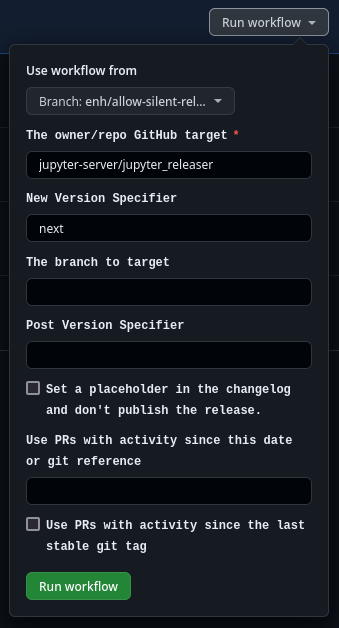
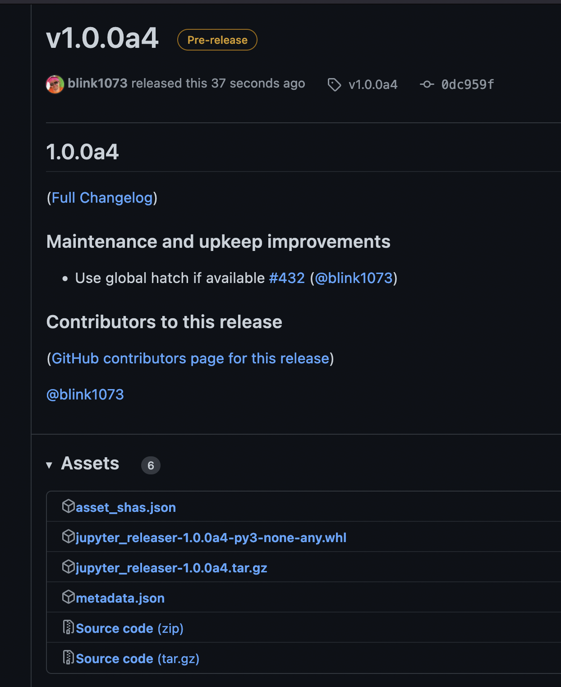
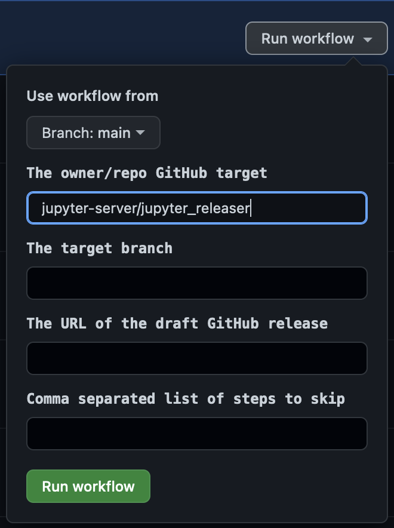

# Making Your First Release from Jupyter Releaser

This guide covers creating your first release on a repository that
already uses Jupyter Releaser.

## Prerequisites

- Write access to the target repository
- Publish access to PYPI and/or npm assets associated with the repo

## Set up

- Fork `jupyter_releaser`

- Generate a [GitHub Access token](https://docs.github.com/en/github/authenticating-to-github/creating-a-personal-access-token) with access to target GitHub repo to run GitHub Actions

- Add the token as `ADMIN_GITHUB_TOKEN` in the [repository secrets](https://docs.github.com/en/actions/reference/encrypted-secrets#creating-encrypted-secrets-for-a-repository) of your fork. The token must have `repo` and `workflow` scopes.

- Set up PyPI:

<details><summary>Using PyPI token (legacy way)</summary>

- If the repo generates PyPI release(s), create a scoped PyPI [token](https://packaging.python.org/guides/publishing-package-distribution-releases-using-github-actions-ci-cd-workflows/#saving-credentials-on-github). We recommend using a scoped token for security reasons.

- You can store the token as `PYPI_TOKEN` in your fork's `Secrets`.

  - Advanced usage: if you are releasing multiple repos, you can create a secret named `PYPI_TOKEN_MAP` instead of `PYPI_TOKEN` that is formatted as follows:

    ```text
    owner1/repo1,token1
    owner2/repo2,token2
    ```

    If you have multiple Python packages in the same repository, you can point to them as follows:

    ```text
    owner1/repo1/path/to/package1,token1
    owner1/repo1/path/to/package2,token2
    ```

</details>

<details><summary>Using PyPI trusted publisher (modern way)</summary>

- Set up your PyPI project by [adding a trusted publisher](https://docs.pypi.org/trusted-publishers/adding-a-publisher/)
  - if you use the example workflows, the _workflow name_ is `publish-release.yml` (or `full-release.yml`) and the
    _environment_ should be left blank.
- Ensure the publish release job as `permissions`: `id-token : write` (see the [documentation](https://docs.pypi.org/trusted-publishers/using-a-publisher/))

</details>

- If the repo generates npm release(s), add access token for [npm](https://docs.npmjs.com/creating-and-viewing-access-tokens), saved as `NPM_TOKEN` in "Secrets".

> If you want to set _provenance_ on your package, you need to ensure the publish release job as `permissions`: `id-token : write` (see the [documentation](https://docs.npmjs.com/generating-provenance-statements#publishing-packages-with-provenance-via-github-actions)).

## Prep Release

- Go to the "Actions" tab in your fork of `jupyter_releaser`

- Select the "Step 1: Prep Release" workflow on the left

- Click on the "Run workflow" dropdown button on the right

- Fill in the appropriate parameters

  

  - The "New Version Spec" will usually be the full version (e.g. 0.7.1). Repos using `tbump` can also use the "next" or "patch"
    option, which will bump the micro version (or the build version in the case of a prerelease). The "minor" option allows projects using "tbump" to bump
    to the next minor version directly. Note: The "next" and "patch" options
    are not available when using dev versions, you must use explicit versions
    instead.

  - Use the "since" field to select PRs prior to the latest tag to include in the release

  - Check "Use PRs with activity since the last stable git tag" if you would like to include PRs since the last non-prerelease version tagged on the target repository and branch.

  - Check "Set a placeholder in the changelog and don't publish the release" if
    you want to carry a silent release (e.g. in case of a security release).
    That option will change the default behavior by keeping the version
    changelog only in the GitHub release and keeping it private (aka in _Draft_
    state). The changelog file will only contains a placeholder to be replaced
    by the release body once the maintainers have chosen to publish the release.

  - The additional "Post Version Spec" field should be used if your repo uses a dev version (e.g. 0.7.0.dev0)

  - The workflow will use the GitHub API to find the relevant pull requests and make an appropriate changelog entry.

  - The workflow will create a draft GitHub release to the target
    repository and branch, with the draft changelog contents.

  

## Review Changelog

- Go to the draft GitHub Release created by the "Prep Release" workflow

  

- Review the contents, fixing typos or otherwise editing as necessary.

- If there is a section called "Other Merged PRs", it means those PRs did not have one of the appropriate labels. If desired, you can go label those PRs and then re-run the workflow, or move the entries manually to the desired section. The appropriate labels are: bug, maintenance, enhancement, feature, and documentation.

## Publish Release

- Return to your fork of `jupyter_releaser`

- Click on the "Actions" tab

- Select the "Publish Release" workflow on the left

- Click on the "Run workflow" button on the right

- Fill in the target repository

- (Optional) Fill in draft GitHub Release URL given by the Changelog PR.
  If you leave it blank it will use the most recent draft GitHub release.

  

- The workflow will finish the GitHub release and publish assets to the appropriate registries.

- If the workflow is not targeting the default branch, it will also generate a forward-port pull request for the changelog entry to the default branch.

- When the workflow finishes it will print a link to the GitHub release and the forward-port PR (if appropriate) in the "\*\* Next Step \*\*" output.

  

- **Note** If the publish portion fails you can attempt to publish the draft GitHub release given by the URL in the "\*\* Failure Message \*\*" using the "Publish Release" workflow again. It will skip past the asset creation phase
  and move into asset publish.

- **Note** GitHub Actions caches the secrets used on a given workflow run. So if you run into an auth issue, you'll
  need to run a new workflow instead of re-running the existing workflow.

- Review and merge the forward-port PR if applicable

- Announce the release on appropriate channels
