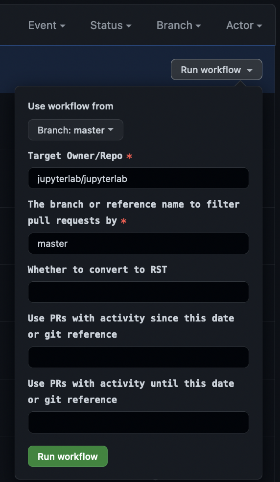

# Generating a Manual Changelog Entry

The "Generate Changelog" workflow is useful for repositories or branches that do not yet use Jupyter Releaser.

You can generate a markdown or reStructuredText changelog entry and manually apply it to the repo.

The workflow does not require any credentials.

To run the workflow:

- Go to the "Actions" tab on the source repository or your fork.

- Click on "Generate Changelog" on the left navigation bar

- Click the "Run workflow" dropdown button on the right and fill in the appropriate values

  

  - Write "true" for "Whether to convert to RST" if the target repo uses a reStructuredText changelog

  - The last two fields can be used to constrain the changelog entries to a set of tags or other references

- When the job finishes, download and extract the generated changelog
