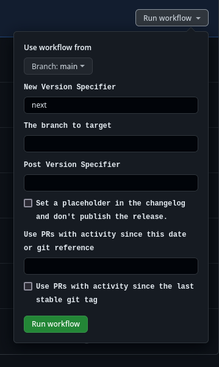
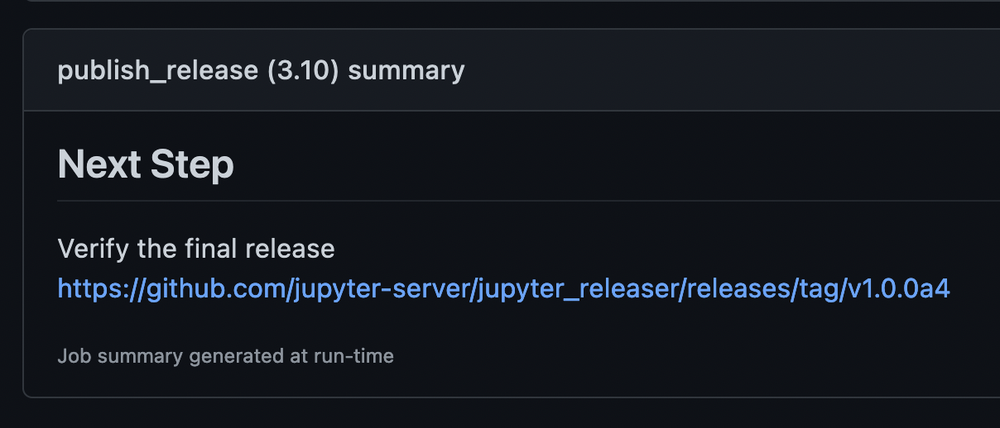

# Making Your First Release from Repo

This guide covers creating your first release on a repository that
already uses Jupyter Releaser using workflows on its own repository.

## Prerequisites

- Admin write access to the target repository
- Previously set up GitHub Actions secrets for PyPI and/or NPM

## Prep Release

- Go to the "Actions" tab in the repository.

- Select the "Step 1: Prep Release" workflow on the left

- Click on the "Run workflow" dropdown button on the right

- Fill in the appropriate parameters

  

- The "New Version Spec" will usually be the full version (e.g. 0.7.1). Repos using `tbump` can also use:

  - "next" or "patch" option, which will bump the micro version (or the build version in the case of a prerelease).
    Note: The "next" and "patch" options are not available when using dev versions, you must use explicit versions
    instead.
  - "minor" option, which will bump to the next minor version directly.
  - "release" option, which will start making prereleases (a0, a1...)

- Use the "since" field to select PRs prior to the latest tag to include in the release

- Type "true" in the "since the last stable git tag" if you would like to include PRs since the last non-prerelease version tagged on the target repository and branch.

- The additional "Post Version Spec" field should be used if your repo uses a dev version (e.g. 0.7.0.dev0)

- The workflow will use the GitHub API to find the relevant pull requests and make an appropriate changelog entry.

- The workflow will create a draft GitHub release to the target
  repository and branch, with the draft changelog contents.

## Review Changelog

- Go to the draft GitHub Release created by the "Prep Release" workflow

  

- Review the contents, fixing typos or otherwise editing as necessary.

- If there is a section called "Other Merged PRs", it means those PRs did not have one of the appropriate labels. If desired, you can go label those PRs and then re-run the workflow, or move the entries manually to the desired section. The appropriate labels are: bug, maintenance, enhancement, feature, and documentation.

## Publish Release

- Return to "Actions" tab for the repository

- Select the "Publish Release" workflow on the left

- Click on the "Run workflow" button on the right

- (Optional) Fill in draft GitHub Release URL given by the Changelog PR.
  If you leave it blank it will use the most recent draft GitHub release.

  

- The workflow will finish the GitHub release and publish assets to the appropriate registries.

- If the workflow is not targeting the default branch, it will also generate a forward-port pull request for the changelog entry to the default branch.

- When the workflow finishes it will print a link to the GitHub release and the forward-port PR (if appropriate) in the "\*\* Next Step \*\*" output.

  

- **Note** If the publish portion fails you can attempt to publish the draft GitHub release given by the URL in the "\*\* Failure Message \*\*" using the "Publish Release" workflow again. It will skip past the asset creation phase
  and move into asset publish.

- **Note** GitHub Actions caches the secrets used on a given workflow run. So if you run into an auth issue, you'll
  need to run a new workflow instead of re-running the existing workflow.

- Review and merge the forward-port PR if applicable

- Announce the release on appropriate channels
