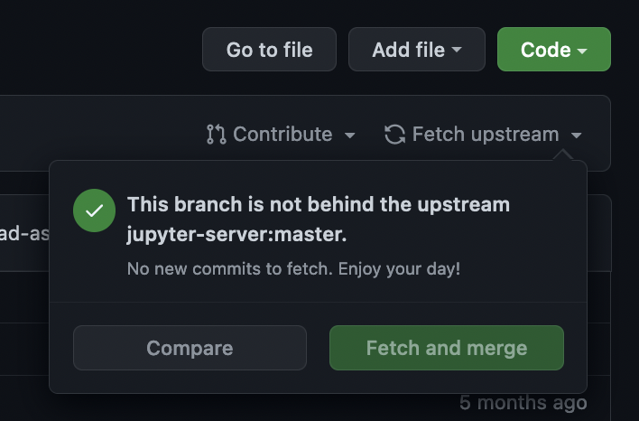

# Maintain a Releaser Fork

## How to keep fork of Jupyter Releaser up to date

- The manual workflow files target the `@v1` actions in the source repository, which means that as long as
  the workflow files themselves are up to date, you will always be running the most up to date actions.

- Make sure your workflow is up to date by checking the "Fetch Upstream" dropdown on the main page of your fork.

  
